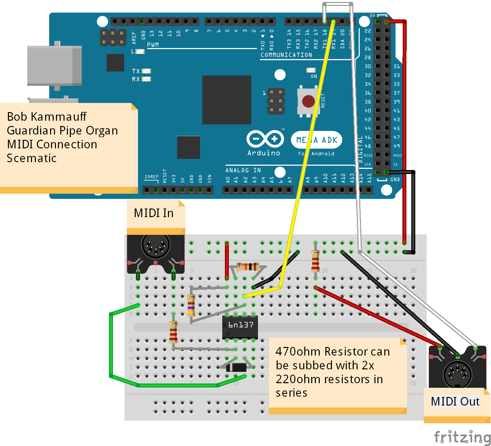

# GuardianPipeOrgan

[](https://www.google.com/url?sa=i&url=https%3A%2F%2Fwww.deviantart.com%2Frongs1234%2Fart%2FTerrako-862044206&psig=AOvVaw2PNPe1dH_EVHYLI62axwsY&ust=1612890263248000&source=images&cd=vfe&ved=0CAIQjRxqFwoTCMC378vi2u4CFQAAAAAdAAAAABAD)

Pardon the dust as we keep updating this README!

ins Table of Contents

### README Requirements

<details>
        
        Knock out the design completely in CAD before you start construction.  Leave room for wires.

        Throughout the project, document your work on github.  You should communicate enough information so that someone else in your class could reasonably replicate your project.

        You should include, in this order:

        Description of the planning that went into the project, design decisions, and engineering details
        Materials used
        Wiring diagram of your circuit
        Commented code
        CAD renderings
        Actual photos and/or video (well lit and in focus)
        Your process or a schedule of how you spent your time
        Discussion of problems, errors, miscalculations, and missteps and how you overcame them
        If you didn't finish, please add an obituary, detailing what you'd do if you picked this project back up, and anything you'd have done differently.
        
</details>

### Project Pre-Planning


1. *Create your question:*


  a. *What's the problem you're trying to solve?*
  
  
    i. Have a robot that can serenade people with beautiful music
    
    ii. Build a self-playing organ
    
  b. *How will you determine if you've solved your problem? (make sure your problem is specific and testable!)*
  
    i. We can play Zelda's lullaby on it and have it sound pure, and at a constant volume. Is a midi output so that it can also play other songs
    
2. *Break down your problem:*


  a. **Criteria (goals):**
  
    i. *How does it solve the problem?*
    
      1.
      
    ii. *~~What should it look like:~~*
    
    iii. *What is it going to do?*
    
  b. **Constraints (limitations)**
  
    i. *Don't hurt anyone*
    
      1. Pressurized Air can be dangerous
      
    ii. *Budget:*
    
      1. I think we can get by with $50
      
    iii. *Time frame* (roughly 2 months)
    
    iv. *Size* (laser cutter: 300mm x 600mm , 3d Printer 8&quot;x8&quot;x9&quot;)
    
      1. The size that the pipes will need to be
      
    v. *Any knowledge limitations that you'll need to correct?*
    
      1. Pneumatics
      
      2. How to design a valve
      
      3. Controlling multiple solenoids with not many pins
      
      4. Flow rate
      
      5. MIDI Input/Output
      
      6. Organ Pipe design
      
3. *Research:*


  a. *Delegate this with your partner! Whose researching what?*
  
    i. Let's make separate Google Docs to take notes in about each topic
    
      1. Bob = MIDI, Using a microcontroller as a MIDI in/out
      
      2. Justyn = Flow rate, pneumatics, fluid dynamics
      
      3. Both: Organ Pipe Design
      
        a. Hopefully getting in touch with an organ manufacturer up in Staunton
        
  b. *Improve your google-jitsu.*
  
  c. *Remember, you DON'T have a plan yet. This is research for pre-planning. Researching mp3 shields….how does a piezo buzzer work, that sort of thing…WHAT IS PID?? How do I determine CoM in Onshape?*
  
  4. I cannot tell you what questions to ask, as they should be very project specific, but for example, you might want to know how an organ pipe works before building an organ, or you might want to know how to calculate wheel speed , before you build a PID box that controls wheel speed.

4. *Make a list of possible solutions:*


  1. *Whats it going to look like?*


  3. *What components will it use?*


    1. Arduino or Circuit Python
    
  4. *How does this solution solve the problem?*


  6. **Make sure to include a short list of pros and cons for each solution.**


  8.

1. We are pretty decided that it's going to be an organ
2. Solenoids or Solenoid Valves?


  1. Solenoids


    1. Pros: Cheaper, less specialized, have been used before for this type of project
    
    
    2. Cons: The solenoid valves are gonna be more precise and a better seal
    
  2. Solenoid valves


    1. Pros
3.

[Link to engineering design process:](https://www.teachengineering.org/design/designprocess)

[Link](https://docs.google.com/document/d/1uND1lurYmUpj-_9FQsYxZuwOPflugXZLaDDHEH4wFzs/edit?usp=sharing)

### Materials used
* 32 Valves (laser-cut casing, [3/16" ID x 5/16" OD silicone tubing](https://www.amazon.com/dp/B07TH8H1QP/ref=cm_sw_em_r_mt_dp_J0TEWZFQ2DN48WCQM4QV?_encoding=UTF8&psc=1), and 3D printed cam)
* 32 3D printed Organ Pipes 
* Arduino Mega (from Dr. Shields)
* [MIDI 5-pin to USB-A Cable](https://www.amazon.com/dp/B087G7L7J2/ref=cm_sw_em_r_mt_dp_3BY1T0T89K53A4C2TZDT?_encoding=UTF8&psc=1)
* [MIDI connector](https://www.amazon.com/dp/B07NY6Z2N7/ref=cm_sw_em_r_mt_dp_BFAF0GJ7GPHXVVTXCVRJ?_encoding=UTF8&psc=1)
* 220 Ohm 1/4watt resistor (In Sigma Lab)
* [1N4148 diode](https://www.amazon.com/dp/B06XB1R2NK/ref=cm_sw_em_r_mt_dp_FQDK5978XHRZRAK23W6Y) (I had one on hand, but I included a link to order one as well)
* 10k Ohm 1/4watt resistor (In Sigma Lab)
* 470 Ohm 1/4watt resistor (I used 2x220 instead)
* [6N138 optocoupler](https://www.amazon.com/dp/B07DLTSXC1/ref=cm_sw_em_r_mt_dp_HDJK9QW9ZMRRCRK7CJNF?_encoding=UTF8&psc=1)
* Balloons!
* Lots of bolts and screws
* Breadboard
* wires

### Wiring

[MIDI Fritzing file](Wiring/MidiCircuit.fzz)

[](Wiring/MidiCircuit.png)

### Pseudocode
Link to code [here.](GuardianPipeOrganOutPseudoCode)

<details>
        
        ```python
        # Bob Kammauff
        # 2/4/2021
        # Guardian Pipe Organ - Output
        # pseudocode

        # at the top here, put all of the libraries we'll be using

        import time

        import digitalio
        import touchio
        import busio
        import board
        import usb_midi
        import neopixel


        import adafruit_midi

        from adafruit_midi.note_on          import NoteOn
        from adafruit_midi.control_change   import ControlChange
        from adafruit_midi.pitch_bend       import PitchBend

        # + some others that I don't know about

        # set up any serial port communication we'll need

        # using some type of shift register or port thingy to get more pins
        # so initialize that

        # Read any incoming MIDI messages (events) over USB
        # looking for note on, note off messages

        # Our organ will have 32 notes starting at middle C (C4) and going up to G6
        # Each time a note on value is detected, write the pin connected to that note's solonoid high
        # Each time theres a note off value, write the pin low

        # there will be transistors in between every solonoid to supply the correct voltage
        ```
   
</details>

## Working on the Code

Throughout this process, I gradually moved from using multiple metro expresses, to using a metro and an Arduino Mega, to using just the mega. So a lot of what I've written is very specific to the point in time when I was using a metro M0. If you want to read that stuff, I'll include it all into a expanding section:

It's not required for the rest of the README to make sense

<details>

So, I do not have the transistors or the shift registers or any of that fancy stuff yet; all I got is a Circuit Python and some LED's, but the coding will be the same either way. Let's set up a circuit python to read Midi Data coming from my computer to light up some led's.

The wiring is easy. a bunch of LED's and resistors. Iet's get working on the code for it.

Ok so I've already run into a couple problems about how to write the code. The code I'm taking it from sets all of the pins using a for loop. But, I can't find a way to do that with digital pins because they require a 2nd initialization to tell the pin whether to be input or output. Brute forcing it might just be the correct solution, but the idea of having the pins in an array just makes the code so much simpler.

Now that I've described the problem, the solution seems clear: do a mix

This didn't work
        
```python
pins = [board.D13,
        board.D12,
        board.D11,
        board.D10,
        board.D9,
        board.D8,
        board.D7,
        board.D6,
        board.D5,
        board.D4,
        board.D3,
        board.D2]


# add LED's
# ledG = digitalio.DigitalInOut(board.D1)
# ledG.direction = digitalio.Direction.OUTPUT
# n
# or do it like this

noteLEDs = []
x = 0
for pin in pins:
    noteLEDs = [digitalio.DigitalInOut(pin)]
    print(str(pin))

del pins, x  # done with that
noteLEDs.direction = digitalio.Direction.OUTPUT
```


Lets try this now: set the pins each to a variable, then set each variable to a list.

```python
pinD13 = digitalio.DigitalInOut(board.D13)
pinD12 = digitalio.DigitalInOut(board.D12)
pinD11 = digitalio.DigitalInOut(board.D11)
pinD10 = digitalio.DigitalInOut(board.D10)
pinD9 = digitalio.DigitalInOut(board.D9)
pinD8 = digitalio.DigitalInOut(board.D8)
pinD7 = digitalio.DigitalInOut(board.D7)
pinD6 = digitalio.DigitalInOut(board.D6)
pinD5 = digitalio.DigitalInOut(board.D5)
pinD4 = digitalio.DigitalInOut(board.D4)
pinD3 = digitalio.DigitalInOut(board.D3)
pinD2 = digitalio.DigitalInOut(board.D2)

pinD13.direction = digitalio.Direction.OUTPUT
pinD12.direction = digitalio.Direction.OUTPUT
pinD11.direction = digitalio.Direction.OUTPUT
pinD10.direction = digitalio.Direction.OUTPUT
pinD9.direction = digitalio.Direction.OUTPUT
pinD8.direction = digitalio.Direction.OUTPUT
pinD7.direction = digitalio.Direction.OUTPUT
pinD6.direction = digitalio.Direction.OUTPUT
pinD5.direction = digitalio.Direction.OUTPUT
pinD4.direction = digitalio.Direction.OUTPUT
pinD3.direction = digitalio.Direction.OUTPUT
pinD2.direction = digitalio.Direction.OUTPUT


noteLEDs = [pinD13,
            pinD12,
            pinD11,
            pinD10,
            pinD9,
            pinD8,
            pinD7,
            pinD6,
            pinD5,
            pinD4,
            pinD3,
            pinD2]

# Brute forced
```
</details>

Anyway, here's my thought process simplified:

After trying to get serial communication working with a metro express and failing for a week, I decided to totally ditch using one and instead use just an arduino mega to process MIDI data and control all of the servos. 

This means that instead of being able to send midi data just across the usb cable like with the metro, I actually had to go and order a MIDI to USB cable from Amazon. [Here's](https://www.amazon.com/dp/B087G7L7J2/ref=cm_sw_em_r_mt_dp_3BY1T0T89K53A4C2TZDT?_encoding=UTF8&psc=1) the one I ended up buying.

I guess I should explain my goals for this code:

1. Connect the arduino mega to the 32 servos that control the valves
2. Receive data being transmitted over the MIDI IN jack hooked up to the computer
3. process that data to get what note should be either turned on or off
4. send the corresponding command to the servo, allowing air to pass, and make the organ pipe speak.

[Here's](https://github.com/jkammau97/GuardianPipeOrgan/blob/8430313b24fd7d28eb77173dfa6983c463fdca4e/Arduino%20Code/GuardianPipeOrganV1/GuardianPipeOrganV1.ino) the code I came up with for the servos:

<details>
        ```arduino
        
        /*
          Bob Kammauff & Justyn Reyes
          Midi Output - Guardian Pipe Organ
          3/25
          Last Updated: 5/24/2021
        */

        #include <Servo.h>
        #include <stdio.h>
        #include <string.h>


        #define NUM_NOTES 32
        #define FIRST_PIN 22
        Servo servos[NUM_NOTES];

        #define OFF_ANGLE 0
        #define ON_ANGLE 180


        #define FIRST_NOTE 53 //corresponds to F3
        #define LAST_NOTE 84 //corresponds to C6

        //If input falls outside this range, data gets thrown out

        int note, velocity;

        String fromSerial;

        char input[10];

        int incomingByte = 0; // for incoming serial data

        void setup() {
          // put your setup code here, to run once:
          Serial.begin(9600); //For communicating with the computer

          for (int i = 0; i < NUM_NOTES; i++)
          {
            servos[i].attach(i + FIRST_PIN);

            Serial.print("Servo ");
            Serial.print(i);
            Serial.print(" attached to pin ");
            Serial.println(i + FIRST_PIN);
            servos[i].write(OFF_ANGLE);

          }
          Serial.println("All Servos Attached");

          for (int n = 0; n < NUM_NOTES; n++)
          {
            Serial.print("Testing servo ");
            Serial.println(n);
            servos[n].write(ON_ANGLE);
            delay(100);
            servos[n].write(OFF_ANGLE);
            delay(50);
          }

          Serial.println("Done");
        }

        void loop() {
          // put your main code here, to run repeatedly:
          // send data only when you receive data:
          while (Serial.available() > 0)
          {
            fromSerial = Serial.readStringUntil('\n');
            Serial.println(fromSerial); //Echoes back what was received
            fromSerial.toCharArray(input, fromSerial.length());
            // Returns first token
            char *token = strtok(input, " ");
            note = atoi(token);
            token = strtok(NULL, " ");
            velocity = atoi(token);
            // Keep printing tokens while one of the
            // delimiters present in str[].
            if (note >= FIRST_NOTE and note <= LAST_NOTE) //If note is in range
            {
              Serial.print("Note is: ");
              Serial.println(note, DEC);
              Serial.print("Vel is: ");
              Serial.println(velocity, DEC);
              if (velocity > 0)
              {
                servos[note - FIRST_NOTE].write(ON_ANGLE);
              } else
              {
                servos[note - FIRST_NOTE].write(OFF_ANGLE);
              }

            }


          }
        }
        
        ```
</details>

This code simply establishes communication with the servos, and ties each one to a note. In MIDI, each note on the keyboard is assigned a name and an integer corresponing to said note, and then the next part of the data packet the midi sends over is called velocity, which is simply how loud the note should be played. I'll include some specifics about how a midi byte is transferred in the section about the midi code, but for now, all you need to know is that midi data simply sends over a note and whether to turn it on or off at the time when it is sent. So, back when I had no access to said midi data, I made up my own and simply sent it over the serial monitor from my computer. The syntax for said data is: note integer, space, velocity integer(anything that wasn't zero turned it on, with zero turning it off), and another space. My code takes that data, splits it via the spaces, and then converts the text of the numbers into actual integer values that it can use in calculations. These values are then echoed back over the serial monitor, and the corresponding servo makes the correct movement. 
        
Now, for the MIDI code that reads the data coming over the ports! [Here](Arduino Code/ReceiveMidiWEdits/ReceiveMidiWEdits.ino) it is!

I'm actually going to wait to put it in the README for now. It needs a LOT of polishing up, but this is the source that I got it from, and where I'm going to continue to work on this code
        
This code DOES work and it works consistently, but it's not giving me the data that I was expecting it to. It's like a geode; the gem I'm looking for is in there, but it's gonna take some parsing to extract it into a useable chunk. instead of giving me `command, note, velocity` like I was expecting, it's giving me: `Command byte, 255, 255, Note byte, 255, 255, Velocity byte, 255, 255`


### CAD

[Link to Onshape](https://cvilleschools.onshape.com/documents/e358e4e3ba9e07c5ae938246/w/c6c09eac29318e33af1bc1ef/e/29cbd6e08dd43a0f8d613074)
        
The majority of this project was spent in CAD HELL. Trying to make a 3D object that converts air into sound is challenging to get right. What I first ended up doing was researching how Pipe organ pipes make sound and what kind of geometry creates said conditions. 
        
### Media

### Schedule

| 1st week |  Get midi working with the circuit pythons  |  Feb. 22nd-26th |
|:--------:|:-------------------------------------------:|:---------------:|
| 2nd week | Order all of the parts we’ll need           | Mar. 1st-5th    |
| 3rd week | Design the organ pipes and the valve system | Mar. 8th-12th   |
| 4th week | Design the Shell to put the organ into      | Mar. 15th-19th  |
| 5th week | Fabrication                                 | Mar.22nd-26th   |
| 6th week | Troubleshooting (buffer week)               | Mar. 29th-Apr.2 |


#### 3rd Week

Bob Goal: Finish the design for the organ pipes. Design the Valve system.

Justyn Goal: Fix up the github, Add pictures, cad, toc. Lay out the valves once Bob Has made the valves

Evaluation: Bob really had trouble delegating work, so we only achieved designing the valve system. We finally our 3D printed Whistle prototype and that has caused us to reevaluate the design of our organ. Instead of using open flue organ pipes, we are going to use closed organ flue pipes, because they allow for a lower tone in a smaller size, and require less air pressure. And we are going to do pipes C5-G7 so they are smaller yet (longest one is 1/2 a foot!) Since they are now smaller, the silicone tubing of 1/4" might be too big now, which means we'll have to redesign the valve to fit the new size of tubing.

#### 4th Week
Justyn: Design the Organ pipes to make them stopped and tune-able by adjusting the screw on stopper. Add nozzle on the bottom to directly friction fit connect the tubes to. add brackets to the design of the organ pipes to hold them upright

Bob: Work on code; Get Servos working with midi and arduino mega.

3/17/2021

Justyn is having computer problems so I'm the only one who can do Onshape. I had to really think about how big everything was going to be, so I had to scale it down to the bottom note of F4 instead of C5. Really, I just couldn't realistically fabrcate pipes smaller than that C7 stopped pipe. I added threads on to both the cap and the top of the pipe so that the pipes can be tuned relatively easily. Hopefully. Next course of action is to define the silicone tubing size again and then remake the valve so it is smaller. Lot's of redesigning, but it will all work out.

#### 5th Week

Ok so thankfully, at the time I am writing this, my life has just gotten way less busy. All of my music stuff is done, so it's time to focus on school again. But we're also super behind on schedule. Today, I just realized that there was an extremely simple solution to this project: buy a cheap melodica and put it in the guardian. Unfortunately, we're already so deep into the organ pipes that it's pointless to just start from scratch, and besides; I prefer the flute tone of the pipes instead of the reedy tone of te melodica. That, and that the melodica wouldn't fit nicely in the robot. but that's an easy idea to save for the future!

This week, Bob is on code, and Justyn is on CAD. Thankfully, I think most of the code for the arduino mega is already on the internet so I can just borrow it. But first, we need to establish a tubing size, and then 

### What Went Wrong

Why will I be unable to finish this project by the end of the year? A few reasons:

1. Lack of In-Person Lab time with my partner
2. Long turn-around on fabrication
3. The project is just insane

#### 1. Lack of In-Person Lab time with my partner

Never being able to actually see my partner face to face makes it extremely difficult to collaborate. I would try to delegate work for him to do but not being able to see him doing it and making sure he stayed on track meant that I would ultimately be the one doing it. Me also being the only one to understand the physics of sound and midi also meant it was challenging to convey what I wanted. 

I could fix this in the future by not choosing such a complicated project to do during a national pandemic. Also I started to remedy the problem by coming in on my virtual days when we started having school in person. 

#### 2. Long turn-around on fabrication

This started with me 3D printing the first test whistle. It easily took 2 weeks from submitting the file for printing to actually get it into my hands so I could test it. That day I learned the hard lesson to never print a closed cyllender. To quote my teach: 
> "closed or nearly closed cylinders are nightmares, filled with monsters and support material that wont dissolve."

This was just the starting point of design hell. Trying to print something that makes sound is incredibly difficult, because you just can't see how it will sound in CAD; you have to print it out and test it.

Thankfully I did my research and found out how whistles make noise so there was less of that, but I still had to print out 5 separate pipes before one of them actually worked. When ur not in the lab 5 days a week, it just increases the turn-around time as it would have to dissolve in the bath for at least a day after printing

The circumstances aren't just to blame; I also had to learn how to design parts that would use no support material. I did a good job with it tho, cuz my parts are now real nice.

#### 3. The project is just insane

When I was first pitching it to my teacher, he thought I just wanted to make a robot play music, so he suggested that I just use a MP3 shield and call it a day 

**Oh how easy that would've been...**

MIDI-Controlled Pipe Organs are just so cool. Something about bringing the perfection of MIDI into the physical world just sounds so cool when you hear it. But it's also just unlike anything anyone else here has tried to do, so I have to build it from the ground up. Thankfully there are projects online that are quite similar, but I was still just trying to figure out the best way to do it only a month ago. 

Now, taking all of that into consideration, by how the past couple of weeks have been going, I think I'll be able to finish it before next school year. Right now, I have two more weeks of school, plus two weeks of engineering "camp" after that. The project is nearing completion in CAD, and now I'm in stuff I have actually done before (Making the thing for it all to fit into!!)

So, if you'll excuse me, I have work to do.

-Bob K.
6/1

#### What i will do to finish

6/7/21
